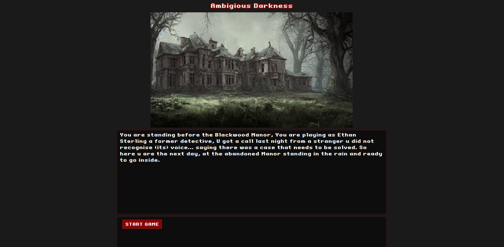
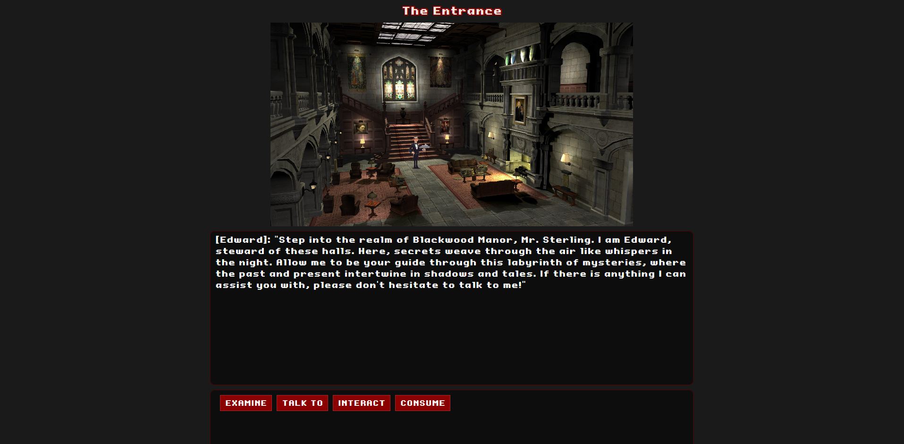

# Text based adventure game
A custom built text based adventure game using **Typescript** (Lit with HTML and CSS for components) and **Express.js**. The website is a single-page application using reusable components to fill and update the page. 

## Table of Contents
* [Indtroduction](#introduction)
* [Used technologies]()
* [Preview](#preview)
* [Installation](#installation)
* [Contact](#contact)

## Introduction
This project is a custom game engine specifically crafted to manage text-based adventures and modular game mechanics. Developed with TypeScript to ensure type safety and scalability, and utilizing Express.js for a flexible and reliable API, this engine delivers a powerful backend capable of handling game logic, player interactions, and game states effectively.

The game has multiple rooms, and each room has a puzzle/riddle which you'll have to solve to finish the game. 

## Used technologies
- **[TypeScript](https://www.typescriptlang.org/docs/)**: Ensures type-safe code for better maintainability.
- **Lit**: A lightweight library for building fast, reusable, and customizable web components.
- **[Express.js](https://expressjs.com/)**: Manages API endpoints and server-side logic.
- **Node.js**: The runtime for building scalable network applications.
- **SQL**: For storing game states and user data.
- **REST API**: For seamless communication between client and server.

## Preview
### Start room


### The Entrance


## Installation

### Installing the project 
```
git clone https://github.com/Jayson-1307/Text-based-adventure-game.git
cd text-based-adventure-game
npm install
```

### Running the project
#### If u want to run both the Front- and Backend:
Run this command in the terminal:   
```
npm run dev
```
this will run both the Front- and backend

#### Or if u want to run the Front- and backend seperately
In two seperate terminals, run the following commands: 

**API**
```
npm run dev -w src/api
```

**Web**
```
npm run dev - w src/web
```

Open 'localhost:3000' in your browser, and the webshop should be shown!

## Contact
If you have any questions or saw something interesting, feel free to contact me!    
U can send me an email: jvanolffen@outlook.com or send me a direct message on [LinkedIn](https://www.linkedin.com/in/jayson-van-olffen/)! 


