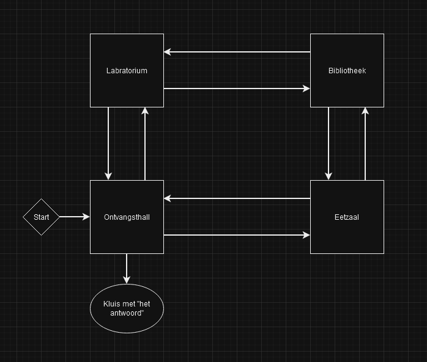

# Product review

## Inhoudsopgaven 

1. [Wat willen wij met dit document laten zien](#wat-willen-wij-met-dit-document-laten-zien)
2. [Game inhoud](#game-inhoud)
    1. [Verhaallijn](#verhaallijn)
        1. [Algemene storyline](#algemene-storyline)
        2. [Prologue](#prologue)
    2. [Room verdeling](#room-verdeling)
        1. [Algemene informatie](#algmene-informatie)
        2. [Kamer verdeling onderling](#kamer-verdeling-onderling)
    3. [Characters](#characters) 
    4. [Items en Puzzelelementen](#items-en-puzzelelementen)
    5. [Room schets](#room-schets)
    6. [Moodboard](#moodboard)
3. [Oude design](#oude-design) 
4. [Testplan](#testplan--feedback)
5. [Nieuw design met verwerkte Feedback](#nieuw-design-op-basis-van-feedback)
6. [Samenwerking & Planning](#samenwerking--planning) 
    1. [Samenwerkingscontract](#samenwerkingscontract)
    2. [Zelfgemaakte user stories](#zelfgemaakte-user-stories)
    3. [Daily-standups Log](#daily-standup-log)

## Wat willen wij met dit document laten zien 
Met dit document laten wij zien dat wij de kwaliteits- en gedragscriteria van de opleiding HBO-ICT begrijpen en ook gebruikt hebben in ons project. Door het gehele bestand staan bij
Voor het gemak is een inhoudsopgaven aan het begin van dit document gemaakt. Aan het einde van dit document bevinden de bronnen die gebruikt zijn met het maken van deze documentatie.
 

## Game inhoud
Hier zullen we even door alle bedachte aspecten van de game heenlopen. Dingen zoals Storyline, characters, moodboard en andere inhoudelijke elementen zullen hier aan bod komen. Veel dingen zullen in het engels zijn omdat de game zelf in het engels zal zijn. *Hierbij zullen wij dat zelf toelichten.* 

### Verhaallijn
#### Algemene storyline
**The shadows of Ethan Sterling**

Stap binnen in de intrigerende wereld van "De Verborgen Schaduwen van Ethan Sterling", een text-based avonturenspel doordrenkt met geheimen en Mistery. In dit spel neem je de rol aan van Ethan Sterling, een voormalige detective die wordt uitgenodigd om een afgelegen landhuis te onderzoeken, dat bekend staat om zijn mysterieuze geschiedenis en duistere geheimen.   

Bij aankomst wordt Ethan verwelkomd door de sombere ontvangsthal van Blackwood Manor, waar de sfeer doordrongen is van een gevoel van verloren glorie en vergeten verhalen. De enige metgezel van Ethan in dit landhuis is de stille en mysterieuze butler Edward, die hem verwelkomt met een fluistering van een verleden dat net zo duister is als de schaduwen die de gangen vullen.   

Gedreven door zijn verlangen om de waarheid te achterhalen, begint Ethan zijn onderzoek in de ontvangsthal, waar hij al snel stuit op aanwijzingen die hem naar de bibliotheek, het laboratorium en de eetzaal leiden. Elk van deze kamers herbergt zijn eigen mysteriën en uitdagingen, en Ethan moet zijn scherpzinnigheid en deductieve vaardigheden gebruiken om de verborgen waarheden te onthullen.   

Terwijl Ethan dieper in het landhuis doordringt, worden de grenzen tussen realiteit en verbeelding steeds vager. Hij wordt geconfronteerd met herinneringen uit zijn verleden, flarden van gesprekken die hij had in zijn vroegere leven als detective. Hij begint te twijfelen aan zijn eigen geestelijke gezondheid, terwijl hij worstelt om de waarheid te scheiden van de leugens die hem omringen.   

Uiteindelijk leidt Ethans zoektocht hem naar een afgesloten kluis, verstopt in de diepste hoeken van het landhuis. Daar, achter de beveiligde deur, wachten de antwoorden die hij zo wanhopig zoekt. Maar wanneer Ethan de kluis opent, wordt hij geconfronteerd met een onthulling die zijn wereld op zijn kop zet en zijn eigen identiteit in twijfel trekt.   

De waarheid blijkt complexer te zijn dan Ethan ooit had kunnen vermoeden, en hij realiseert zich dat de sleutel tot het ontrafelen van het mysterie misschien wel in zijn eigen geest verborgen ligt. Als hij geconfronteerd wordt met zijn eigen schaduwen, moet Ethan de waarheid accepteren, zelfs als het betekent dat hij zijn eigen demonen onder ogen moet zien. En in de stilte van Blackwood Manor, fluistert de butler misschien meer dan alleen vergeten verhalen.   
  

#### Prologue
Wanneer je de game begint krijg je een korte intro, dit heet de "prologue". Hier zal de prologue die wij tot nu toe hebben, volgen.   

In the eerie stillness of Blackwood Manor, where time seems to stand frozen in the grasp of forgotten memories, a lone figure steps into the shadows, seeking answers that lie buried within its ancient halls. Meet Ethan Sterling, a seasoned detective lured by the allure of mystery and intrigue. Welcomed by the enigmatic butler, 'Edward', Ethan's journey begins with a sense of purpose, his mind poised to unravel the secrets that shroud the estate in whispers.   
 

### Room verdeling
Hier zullen we kijken naar de rooms binnen onze game, en hoe deze vereeld zijn.   
 

### Algmene informatie
Voor de rooms hebben we er 4 gekozen omdat we met 4 man aan het project werken.  

Rooms:  
- Main-hall
- dining-room
- library
- laboratory     
 

**Doorloop van de kamers:**   
Het begin van het spel speelt zich af in de *Main-hall* waar je word begroed door butler Edward, daarna als je de sleutel hebt gevonden kun je naar de volgende kamer, de *Dining-room* waar je twee characters tegen komt genaamd: Ölga en Kevin de chef en sous chef. Hier moet je weer de sleutel vinden om naar de volgende kamer te gaan genaamd de *Library*. In deze oude stoffige kamer is er een character: old lady Bertha, die niet met je praat tenzij je haar een item geeft. Om naar de laatste kamer te gaan moet je weer een sleutel vinden en uiteindelijk kom je aan in de *laboratory*, waar je moet experimenteren met verschillende formules. Nadat je in de laboratory bent geweest moet je weer een sleutel vinden om terug te komen in de main hall, omdat daar de laatste opdracht voor je ligt om de waarheid te ontdekken van de moordenaar.   
 

### Kamer verdeling onderling
- Jayson: Main-hall
- Dean: library
- Aydin: dining-room
- Berkay: laboratory	 
 

### Characters
**Main Character:** 
- *Ethan Sterling* 
- Alter Ego: *"Hades"*   
 

**Side characters:**   
- Butler(Main hall): *Edward* 
- Chef(Dining-room): *Ölga*
- Sous chef(Dining-room): *Kevin*
- Old lady(Libary): *Bertha* 
- Profesor(laboratory): *Kurt*

### Items en Puzzelelementen 
[Bekijk hier de Mindmap met daarin alle items en puzzelelement.](https://miro.com/welcomeonboard/VlhUVVBoZmpJUjhLWkNmdHg5b2RzWUl0WkUxY2U1UXd6QmFDeEM0ZGpCZmJrWGJzZUFuZjlPRXhYUFZPMndFQnwzNDU4NzY0NTc4MjAyOTY2OTY2fDI=?share_link_id=423335425224)

### Room schets

### Moodboard
[Bekijk hier ons moodboard](https://miro.com/app/board/uXjVNwWVmO8=/?share_link_id=931873521112)  
 

## Oude design
We zullen even laten zien waarmee wij onze test hebben uitgevoerd, zodat we een goed beeld kunnen krijgen van wat er precies is veranderd. 

### Figma design
Url:   
https://www.figma.com/file/spzcaYklpsAMOccKmYwAtn/Guerilla-test-Blok-3-sprint-0?type=design&mode=design   
 

## Testplan & Feedback
We zullen hier een kijkje nemen naar ons testplan. We gaan kijken naar hoe de test in elkaar zat, hoe de tests verliepen en we gaan een kijkje nemen naar de feedback die we hebben gekregen.  

[Bekijk hier ons uitgevoerde testplan](https://gitlab.fdmci.hva.nl/propedeuse-hbo-ict/onderwijs/2023-2024/out-d-se-gd/blok-3/seezoopuuqii86/-/blob/Jayson-development/docs/Folders-Jayson/testplan.md?ref_type=heads)
 

## Nieuw design (op basis van feedback)
Met de informatie uit de test in ons hoofd, laten we een kijkje nemen naar de veranderingen die hebben plaatsgevonden. 

[Bekijk hier ons nieuwe design](https://www.figma.com/file/zx1jTw03hTWqlzssC7Ucv9/Guerilla-test-Blok-3-sprint-0-(updated)?type=design&node-id=0-1&mode=design)
 

## Samenwerking & Planning
Hier zullen we een kijkje gaan nemen naar onze afspraken, samenwerking en hoe wij te werk gaan. 

### Samenwerkingscontract
#### Doelstelling

Het doel van dit blok is dat we samen als team een text-based adventure game maken. Dit doen we aan de hand van een contract samen stellen en de richtlijnen te volgen daarvan. Daarnaast bespreken we ook wat we van elkaar verwachten en het meest prettige vinden om met elkaar om tegaan.  
 

#### Werktijden

Voor de werktijden hebben we bepaald om User-stories te gaan gebruiken, dit doen we aan de hand om dit elke week bij te houden in een apart bestand (Daily-standup-link). De dagen die we hiervoor hebben gekozen zijn:

- Maandag (13:15)
- Dinsdag (9:30)
- Woensdag (10:00)
- Donderdag (13:15)
- Vrijdag (11:15)

Elke dag een daily stand up als we aan het project werken door de weeks. Hier bespreken we wat die dag gaan doen zodat we weten wie wat doet en of er mensen achterlopen. Dit houden we bij door een notulist.

Als we vragen of meldingen hebben aan elkaar kunnen we dit ook altijd doen in de aangemaakte discord groep, dit is handig om vanaf afstand ook nog contact te leggen met elkaar. Desnoods kunnen we ook in het weekend verder werken en kunnen we dus samen werken.  
 

#### Afspraken 

Afspraken die we als team hebben gemaakt en wat we willen aankaarten en respecteren tussen het samenwerken.

- Elkaar respecteren 
- Elkaar laten uitpraten 
- Eerlijk naar elkaar zijn 
- Elkaar niet uitlachen als iemand iets niet snapt maar elkaar helpen
- Reflecteren op elkaar als we feedback geven
- Structuur volgen van elke ochtend daily standups
- Code conventies aanhouden 
- Gebruik maken van issue board voor overzichtelijkheid van user story planning 
- User stories oppakken nadat je klaar bent met een oude user story   
 

#### Afspraken doorbroken

Als de afspraken worden doorbroken door een ander, proberen we dit als volwassenen op te lossen onder elkaar en nogsteeds respectvol blijven. Als zelfs dit niet een optie is moeten we een docent er bij halen of een ander tussen persoon en hun feedback terug zien en dit toepassen om het onderling op te lossen.  
 

#### Communicatie 

Communicatie is erg belangerijk onder groeps verband wat lijd naar succes en duidelijkheid of juist niet als er geen goede communicatie is in een groep, voor de communicatie in onze groep is het belangerijk om eerlijk te zijn naar elkaar omdat iedereen meer profeit hier van heeft omdat dat meer duidelijkheid aan geeft en we rekening kunnen houden met elkaar als bijvoorbeeld iemand een dag niet kan op komen dagen, of als iemand vast loopt met een user-story dat hij het niet voor zich zelf houdt maar dit deelt zodat we verder kunnen komen als een team en niet dat je vast loopt als individu.  
 

#### Issue-board 

Door gebruik te maken van de issue-board werken we agile, alleen de vraag is hoe? We beginnen bij het bekijken in de back log waar alle user-stories in staan, nadat we hebben besproken wie wat gaat doen en daarmee tevreden is pak je de user-story of een deel van de user-story als dit opgesplitst is, dan voeg je je naam aan de user-story en zet je hem in de sprint waar je je in bevind. Wat daarna een optie is om tijds gericht te werken om bijvoorbeeld een inschatting te maken hoelang je bezig gaat zijn met een user-story, door dit te doen geef jezelf een deadline en team leden ook en als je over de deadline bent en je loopt nogsteeds vast is het tijd om de team genoot te helpen om verder te komen of een docent vragen voor advies. Door dit aan te houden is het overzichtelijk welke team genoten waar mee bezig zijn.  
 

#### Pipeline

Voor de pipeline hebben we gekozen om sourceTree te gebruiken omdat dit wij al eerder hebben gebruikt (Jayson en Dean) en we dit fijn vinden om een beter structuur te behouden binnen de pipeline, het kan namelijk een chaos worden als we het alleen doen via visual studio code doen. Dus sourceTree is een goed alternatief om een visueel beeld te krijgen in welke branches je werkt en of je branch achter loopt. 

Hoe passen we dit toe en maken we goed gebruik van branches?

Door geen merge conflict op te lopen is er een structuur die gevolgd moet worden. De Master branch mag niet aangeraakt worden alleen wanneer al het werk in develop branch is gemerged en vanuit develop naar de master word gemerged voor het eind product, dit doen we per week. De volgorde van branches is als volgt: Master > Development > Naam van jezelf > Features. Feature branches mogen gemerged worden naar develop met een merge request om door andere developers na gekeken te worden voor merge conflicts. Daarna is het mogelijk om van develop brnach naar master branch te mergen met ook een merge request om alles na te gaan.  
 

### Zelfgemaakte user stories
We gaan hier kijken naar de user stories die we zelf hebben aangemaakt. Zowel per kamer, als in het algemeen. 

[**Bekijk hier de pagina met alle Zelfgemaakte user stories**](https://gitlab.fdmci.hva.nl/propedeuse-hbo-ict/onderwijs/2023-2024/out-d-se-gd/blok-3/seezoopuuqii86/-/boards/18884)   

**Overzichten met zelfgemaakte user stories erin**
- [Bekijk hier de pagina met zelfgemaakte user stories per kamer](https://gitlab.fdmci.hva.nl/propedeuse-hbo-ict/onderwijs/2023-2024/out-d-se-gd/blok-3/seezoopuuqii86/-/boards/18856)   
- [Bekijk hier alle user stories](https://gitlab.fdmci.hva.nl/propedeuse-hbo-ict/onderwijs/2023-2024/out-d-se-gd/blok-3/seezoopuuqii86/-/boards/18819?milestone_title=No%20Milestone)
 

### Daily standup log
We zullen hier even een kijkje nemen naar de documentatie die we bij hebben gehouden van de daily standups. 

[Bekijk hier de daily standup documentatie](https://gitlab.fdmci.hva.nl/propedeuse-hbo-ict/onderwijs/2023-2024/out-d-se-gd/blok-3/seezoopuuqii86/-/blob/Dean-development/docs/daily-standup.md?ref_type=heads)

<!-- 

https://gitlab.fdmci.hva.nl/propedeuse-hbo-ict/onderwijs/2023-2024/out-d-se-gd/blok-2/joovuuzeefee27/-/blob/main/docs/sprint-3/Product-review-presentatie.md?ref_type=heads

K2 - zelf: Op niveau / docent:
Via deze onderdeel worden de bewijzen van "Actiepunten van vorige sprint" getoond.
(zie bewijs).
Url:
https://gitlab.fdmci.hva.nl/propedeuse-hbo-ict/onderwijs/2023-2024/out-d-se-gd/blok-2/joovuuzeefee27/-/blob/main/docs/sprint-3/Product-review-presentatie.md?ref_type=heads#k2-oude-design

K1- zelf: Op niveau / docent:
Via deze onderdeel worden de bewijzen van "User stories" getoond.
(zie bewijs).
Url:
https://gitlab.fdmci.hva.nl/propedeuse-hbo-ict/onderwijs/2023-2024/out-d-se-gd/blok-2/joovuuzeefee27/-/blob/main/docs/sprint-3/Product-review-presentatie.md?ref_type=heads#k1-user-stories

K3 - zelf: Op niveau / docent:
Via deze onderdeel worden de bewijzen van "Eindproduct" getoond.
(zie bewijs).
Url:
https://gitlab.fdmci.hva.nl/propedeuse-hbo-ict/onderwijs/2023-2024/out-d-se-gd/blok-2/joovuuzeefee27/-/blob/main/docs/sprint-3/Product-review-presentatie.md?ref_type=heads#k3-huidige-website-met-verwerkte-feedback

K4 - zelf: Op niveau / docent: 
Via deze onderdeel worden de bewijzen van "Gebruikerstest".
(zie bewijs).
Url:
https://gitlab.fdmci.hva.nl/propedeuse-hbo-ict/onderwijs/2023-2024/out-d-se-gd/blok-2/joovuuzeefee27/-/blob/main/docs/sprint-3/Product-review-presentatie.md?ref_type=heads#k4-testplan

-->