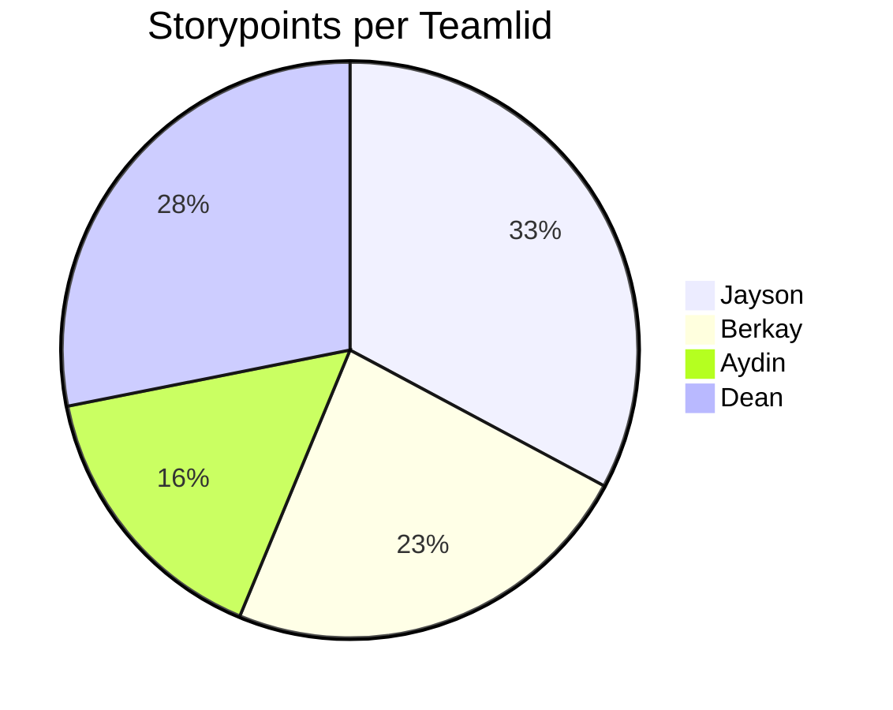

# Retrospective sprint 1

## Verbeterpunten vorige sprint

1. Jayson: Communicatie
    - Om heel eerlijk te zijn is hier grotendeels niks aan veranderd. De enige verbetering was dat we elkaar vaker lieten weten als iemand er niet was/later zou zijn. Verder hebben we niet heel veel met elkaar te maken gehad deze sprint. Alles ging grotendeels individueel.
2. Aydin: Update in daily-standup: 
    - Deze sprint hebben we eigenlijk vrijwel geen daily standups. Op papier dan tenminste. We vertelde elkaar wel vrijwel dagelijks wat we hebben gedaan, waar we nu staan, wat we gaan doen en waar we tegen aan lopen. De daily standup is dus wel veranderd op manier van flexibiliteit, maar niet op basis van de wens die Aydin had vorige week. 
3. Dean: Meer initiatief tonen:
    - Vorige sprint was erg te merken dat de inzet binnen het groepje erg verdeeld was. Deze sprint hadden we vooral taken verdeeld op basis van kamer. Hierdoor werd hoeveel je deed je eigen verantwoordelijkheid en zo merkte je aan het einde van de sprint ook wel wie hoeveel heeft gewerkt. Door te kijken naar de voortgang die iedereen had gemaakt, kon je heel goed zien hoeveel initiatief en inzet mensen toonde om hun gedeelte van het product af te krijgen. Voor dit punt scheelt het dus wel per persoon, maar voor mij persoonlijk ben ik gewoon doorgegaan met veel inzet tonen voor dit product. 

## Uitkomst retrospective

## Verbeterpunten voor de volgende sprint

**Daily standups weer dagelijks en op papier doen:**
    - Aangezien we deze sprint niet elke dag een daily standup hebben gedaan, en dit ook helemaal niet op papier hebben staan, willen wij 

**Betere Communicatie**
    - Alhoewel het melden of mensen aanwezig zouden zijn wel beter ging deze sprint, was onze algemene communicatie achteruit gegaan. Dit komt grotendeels ook doordat ons doel deze sprint was om onze individuele kamer af te maken en je hierbij weinig met elkaar hoeft te praten. Hierdoor was er een flinke stap achteruit in onze communicatie en spraken we elkaar alleen echt op school. 

**Meer input**
    - Er was niet zo super veel om input over te geven deze sprint. Hoe dan ook, werd er bij de aantal dingen waar dit wel bij nodig was door bepaalde teamleden niet eens gevraagd om input en werden er al conclussief getrokken of ideeën publiek gesteld. Dit is wel iets wat in de toekomst drastisch anders moet, aangezien dit voor veel verwarring kan zorgen binnen het team. 

**Meer initiatief**
    - Persoonlijk ben ik niet ontevreden met mijn initiatief en inzet deze sprint. Aangezien het grotendeels heel echt gefocust was op individuele voortgang aan iedereen zijn deel van het product. Alle dingen die gedaan moesten worden in team verband heb ik een grote rol in gespeeld, dus dit vind ik als ik heel eerlijk ben niet perse van toepassing op mij. Voor de andere kan dit natuurlijk anders zijn. Er zullen altijd dingen zijn die makkelijker zijn met meerdere personen, een extra paar handen kan nooit kwaad. Dit moet dan natuurlijk wel uit eigen initiatief kunnen komen, en zou niet constant om gevraagd moeten worden. 

## Teamontwikkeling

// Beschrijf jullie teamontwikkeling over de afgelopen 6 weken aan de hand van de fases van Tuckman. Welke fases hebben jullie doorlopen? Waaraan was dat herkenbaar? In welke fase zitten jullie nu? Waar zie je dat aan?

### Forming 
Naar ons idee waren wij in de eerste week van sprint 0 vooral in deze fase. We begonnen rijk aan ideeën, enthousiast en begonnen al het uitplannen van de game. Hierbij kwam ook veel onzekerheid kijken aangezien we nog niet alle nodige informatie hadden die nodig was om goed vooruit te denken aan hoe we alles zouden gaan uitwerken. 

### Storming
Van sprint 0 week 2, t/m sprint 1 week 1 (De duratie van de individuele opdracht) denken wij dat we door deze fase zijn gegaan. In sprint 0 speelde er wat boosheid tussen het team omdat er taken niet eerlijk werden verdeeld en er weinig input/initiatief was. Ook waren we allemaal best gefrustreerd vanwege de individuele opdracht, en dit bracht ook veel onzekerheden over het beginnen aan ons echte project. Ook kregen we hier pas net de game engine wat allemaal vrij laat was, waar we dus nog mee om moesten leren gaan. Het was allemaal in een keer een hele hoop dingen die erg last moment waren en veel tijd in namen. Hierdoor was er veel irritatie in het team.

### Norming
Vanaf sprint 1 week 2 begon alles een stukje beter te gaan. We konden gaan beginnen aan de game, aan de hand van de dingen die we eerder hadden besproken. De afspraken die we eerder hadden gemaakt, en de afspraken die we nieuw hadden besproken in deze fase waren nu duidelijk en begonnen we ons ook meer aan te houden. Iedereen kon lekker aan de slag aan hun eigen onderdeel van het project. 

### Performing
We zijn momenteel nog niet bij performing, maar we zijn naar ons gevoel wel erg dichtbij. We zijn vrijwel allemaal goed bezig en bouwen echt goed toe naar ons eind product. Deze fase is volgens ons nabij.

## Aandeel teamleden

### Toelichting
Het verschil in punten komt vooral door de complexiteit in de user stories die we per persoon hebben aangemaakt. Ook zal dit komen door de tijd die er per persoon is gestoken in het developen van het product. Als ik terug kijk op de sprint, zie ik dit ook wel terug (en dan kijken we alleen nog maar puur werken aan user stories, nog niet naar de taken in teamverband).

## Feedback voor teamleden

### Feedback Berkay

#### Tops
* Input voor eigen gedeelte van opdracht:
    - Berkay kwam met veel ideeën voor zijn kamer en in ambitieus over het uitwerken hiervan. Dit is iets dat motiverend kan zijn voor andere, als ze even inspiratieloos zijn.    

* Een doorzetter
    - Ondanks dat hij langer bezig is geweest aan de individuele opdracht, heeft hij nog hard gewerkt aan zijn eigen opdracht.    

#### Tips
* Ideeën bespreken met het team voor het openbaar te maken.
    - Zorg ervoor dat als je een idee heb wat leuk kan zijn, je het eerst bespreekt met het team. In de product is het gebeurd dat je de "product owners" een belofte hebt gegeven over het travel systeem, waar niks over was besproken en we het ook niet allemaal over eens zijn. Dat was ook niet de eerste keer dus dit mag wel verbeterd worden.    

* Communicatie
    - Er werd deze sprint niet veel gecommuniceerd over het algemeen, al helemaal niet online. Dit kan dus voor jou, maar eigenlijk ons bijna allemaal wel beter. Dit is natuurlijk ook een stukje initiatief aangezien er wel leden waren die vaker communiceerde.    

### Feedback Dean

#### Tops
* Inzet
    - Ondanks dat je ziek was, heb je veel inzet getoont en ook gezorgd dat je alsnog aanwezig was op belangrijke momenten. Dit betekend veel voor het team. Het laat zien dat je hoe dan ook je best wilt doen. Daarnaast heb je over het algemeen veel gewerkt aan het project.

* Behulpzaam
    - Je bent altijd erg open om te helpen, en bent hiervoor ook makkelijk te bereiken. Het team kan op je rekenen als iemand vastloopt ergens. 

#### Tips
* Serieuzere houding op school
    - Ondanks dat je alles af hebt gekregen deze sprint, kan je werkhouding op school wel wat serieuzer. Je bent vaak een beetje aan t kloten met andere. Gelukkig lijdt jouw productiviteit hier niet onder.

* Blijf zo doorgaan
    - Je bent goed bezig, maar je moet zorgen dat dat zo blijft. Zorg ervoor dat je niet zelfvoldaan word. 

### Feedback Aydin

#### Tops
* Hele grote stap gemaakt in productie
    - Vergeleken met vorige sprint waar je aan de wat passievere kant was, heb je deze sprint je productie flink omhoog gegooid. Je hebt goed werk geleverd tot zo ver, en dat heeft ook een positieve invloed op he team. 

* Creatief
    - Je was deze sprint, net zoals vorige sprint, heel creatief. Voor je eigen kamer heb je leuke additions bedacht, en ook heb je andere geholpen met dingen bedenken om de kamers aan te vullen. 

#### Tips
* Betrokkenheid
    - Meer betrokkenheid over het algemeen met het team zou geen kwaad kunnen. Het ging overigens veel beter deze sprint dan de vorige, maar toch kan het fijn zijn om soms wat meer betrokken te zijn in team besprekingen en dat soort dingen, en niet alleen maar luisterd wat de andere te zeggen hebben.

* Doelgericht werken
    - Alhoewel je deze sprint heel goed hebt gewerkt, kon je werk wel iets meer doelgericht zijn. Je hebt je nu vooral gefocust op de creatieve kant, waardoor er de algemene voortgang richting de eisen van jouw kamer een beetje hebben geleden.  

### Feedback Jayson

#### Tops
* Goed leiderschap
    - Goed leiderschap getoond deze sprint om het team de goede kant op te sturen. Door het team aan te spreken, belangrijke dingen snel op te pakken en informatie snel vermelden.

* Behulpzaam
    - Wanneer er dingen aan je worden gevraagd, reageer je snel en probeer je op een oplossing te komen. 

#### Tips
* Serieuzere houding op school
    - Ondanks dat ik alles en meer af heb gekregen deze sprint, kan mijn werkhouding op school wel wat serieuzer. Ik ben vaak een beetje aan t kloten met andere. Gelukkig lijd mijn productiviteit hier niet onder.

* Blijf zo doorgaan
    - Ik ben goed bezig, maar moet zorgen dat dat zo blijft. Ik moet er voor zorgen dat ik niet zelfvoldaan word. 
