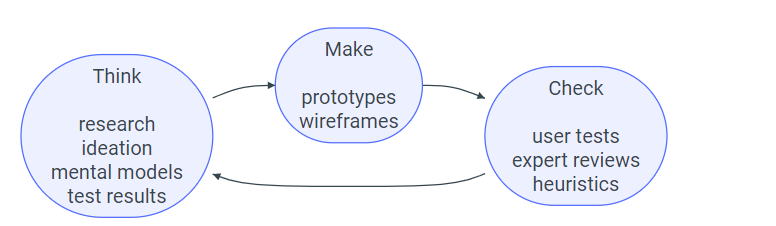
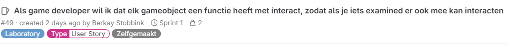
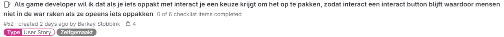
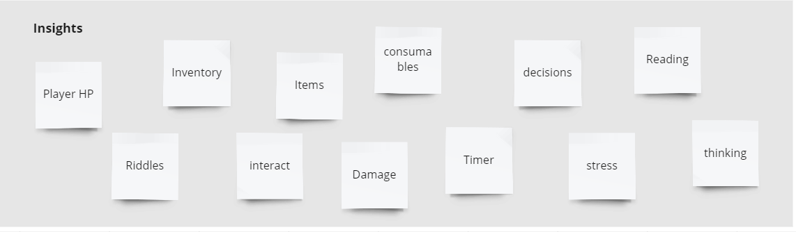
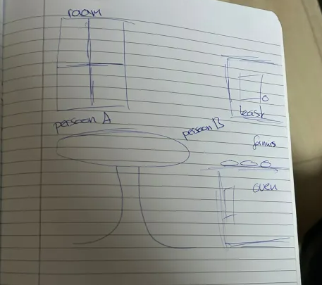
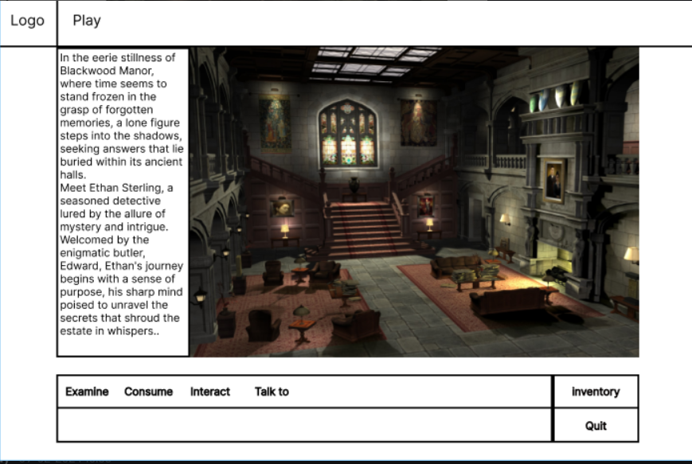

# Documentatie Learning Stories
## Als student wil ik leren hoe ik iteratief mijn product kan optimaliseren met behulp van verschillende prototyping methodes.

### Wat heb ik geleerd?
#### Think make Check cyclus

Ik heb geleerd om de think make check methode te gebruiken zodat ik snel prototypes kan maken en ze kan testen voor goede feedback waardoor je een fijne feedbackloop krijgt waardoor je uiteindelijk op het ideale resultaat komt. 

Met deze afbeelding word goed laten zien wat elk woord inhoud


#### Toepassen van prototyping methoden

In mijn eerste sprint wil ik vooral designs testen zodat ik kan checken of het een gebruiksvriendelijk UI heeft, maar in mijn tweede sprint wil ik bijvoorbeeld vooral testen of het spel volledig werkt en of het spel je een beetje meeneemt. 

#### Gebruiken van tools
  
Ik heb in sprint 0 een basis figma design gemaakt en heb deze UI dus ook laten testen door middel van een guerilla test. Deze feedback heb ik ook verwerkt en heb deze gelijk toegepast. 

#### Aanpassen van prototyping methoden
 
In sprint 1 hebben wij gewoon onze website laten testen en we hebben op basis van resultaten van de guerillatest User stories aangemaakt heeft.



#### Brainstormen ideeen



[Brainstormen](https://miro.com/app/board/uXjVNv_8Jjc=/)

[OpenQuest](https://openquest.hbo-ict.cloud/)

#### Prototyping

Begin schetsen van onze rooms


Onze eerste gemaakte wireframe


Wireframe na feedback en eigen input

[Eind Wireframe](https://www.figma.com/file/zx1jTw03hTWqlzssC7Ucv9/Guerilla-test-Blok-3-sprint-0-(updated)?type=design&node-id=0-1&mode=design&t=hEqzlY8HXZuGNpes-0)

#### Guerilla test

[Ons testplan en resultaten](https://gitlab.fdmci.hva.nl/propedeuse-hbo-ict/onderwijs/2023-2024/out-d-se-gd/blok-3/seezoopuuqii86/-/blob/Jayson-development/docs/Folders-Jayson/testplan.md?ref_type=heads)

### Hoe en waar heb je de learning story toegepast in jullie project?
Deze learning story worden vooral toegepast op voorbereiding van een product review. Hierdoor kan je in je product review bewijzen dat je een gebruikerstest hebt gedaan waardoor je feedback krijgt en je product verbeterd. 


### Bronnen
- Maze. (2023, 6 november). What is Guerrilla Usability Testing? (+ How To Do It)| Maze. Maze. [https://maze.co/guides/usability-testing/guerrilla/](https://maze.co/guides/usability-testing/guerrilla/)
- OpenQuest. (z.d.). [https://openquest.hbo-ict.cloud/](https://openquest.hbo-ict.cloud/)
- Propedeuse, T. (z.d.). Knowledgebase. [https://knowledgebase.hbo-ict-hva.nl/](https://knowledgebase.hbo-ict-hva.nl/)


------------------------------------------------------------------------------------------------------


## Beschrijf per Learning Story: Als student wil ik leren hoe ik static functies en variabelen gebruik in mijn code
 
#### Wat heb je geleerd?

ik heb geleerd dat het de waarde bewaart van de functie waarin het is gedeclareerd. in Typescript heeft elke variabele een eigen instance.


#### geef code snippets/modellen/ontwerpdocumenten van je beste voorbeeld
```typescript
Static

/**
 * Handles interaction with a game object based on its implemented interfaces.
 * 
 * @param {GameObject} gameObject The game object to interact with.
 * @returns {ActionResult | undefined} An object containing the outcome of the interaction, or undefined if the gameObject doesn't implement a relevant interface.
 */
public static handle(gameObject: GameObject): ActionResult | undefined {
  if (implementsInterface(gameObject, ExamineActionAlias)) {
    return castTo<Examine>(gameObject).examine();
  }

  return undefined;
}

```


#### Hoe en waar heb je de learning story toegepast in jullie project?

Ik heb de learning story toegepast voor de examine functie van de objecten in de kamer die je kan onderzoeken. zoals je ziet hierboven heb ik de static functie toegepast in de code van de examine functie. 


#### geef uitleg waarvoor precies je de learning story hebt toegepast in je code/model

ik heb static gebruikt zodat de variabele altijd hetzelfde blijft en niet veranderd kan worden. En zodat ze altijd zichtbaar zijn.

 
#### Hoe heb je de learning story geleerd?

ik heb dit onder de knie gekregen door middel van een tutorial video op youtube. 

Fonteijn, L (28-02-2024) Een Character toevoegen. [video](https://www.youtube.com/watch?v=agJ5CDDsHEc&list=PLvltGXy557e5f9x7XoWDbfsRp6zTjJjBU&index=6).
geraadpleegd op 04-03-2024 dit heeft mij geholpen om De OO-principes polymorfisme toe te passen in mijn code.

licht toe hoe je e.e.a. onder de knie hebt gekregen (workshops, courses, websites, uitleg van studenten/docenten etc.)
verwijs naar websites volgens APA en zorg dat de link hierin werkt


## Beschrijf per Learning Story: Als student wil ik leren hoe ik het OO-principe polymorfisme toepas in mijn code
 
#### Wat heb je geleerd?

ik weet dat polymorfisme wordt bereikt door het implementeren van interfaces en het gebruik van abstracte methoden. Bijvoorbeeld, de Examine interface stelt een contract op voor objecten die deze implementeren om een examine() methode te hebben. Dit betekent dat elk object dat de Examine interface implementeert, een examine() methode moet hebben. ik heb dit toegepast in mijn code.


#### geef code snippets/modellen/ontwerpdocumenten van je beste voorbeeld
```typescript
polymorfisme

export class KeyItem extends Item implements Examine, interact {

  /**
   * Constructor for the KeyItem class.
   * 
   * Inherits from the base Item class and implements the Examine and Pickup interfaces.
   * 
   * @param {string} alias (Optional) Unique identifier for the Key item within the game.
   *   Defaults to the value of the `KeyItemAlias` constant (assumed to be defined elsewhere).
   * @param {string} examineActionAlias (Optional) Unique identifier for the examine action associated with the Key item.
   *   Defaults to the value of the `ExamineActionAlias` constant (assumed to be defined elsewhere).
   * @param {string} InteractionActionAlias (Optional) Unique identifier for the pickup action associated with the Key item.
   *   Defaults to the value of the `InteractionActionAlias` constant (assumed to be defined elsewhere).
   */
  export class KeyItem extends Item implements Examine, Interact {
  public constructor() {
        super(KeyItemAlias, ExamineActionAlias, InteractionActionAlias);
    }

  /**
   * Returns the display name of the Key item.
   * 
   * @returns {string} The name of the Key item, in this case "Key".
   */
  public name(): string {
    return "Key";
  }

  /**
   * Provides a description of the Key item when examined.
   * 
   * @returns {TextActionResult | undefined} An object containing text descriptions for examining the Key item.
   *   The first description is a general observation, and the second suggests a potential use.
   */
  public examine(): TextActionResult | undefined {
    return new TextActionResult([
      "You looked at the key it looks to be in a suprisingly good state, maybe you can use this somewhere?"
    ]);
  }
}

```


#### Hoe en waar heb je de learning story toegepast in jullie project?

ik heb de learning story toegepast in bijvoorbeeld de items die ik heb gemaakt voor het spel. zoals je ziet hierboven heb ik de polymorfisme toegepast in de code van de items. Elke Item kan je examine en sommige kan je opppaken 

#### geef aan in welke user story/stories je het hebt toegepast

- [Als game developer wil ik items toevoegen aan mijn kamer, zodat je dingen kan doen in de dining room.](https://gitlab.fdmci.hva.nl/propedeuse-hbo-ict/onderwijs/2023-2024/out-d-se-gd/blok-3/seezoopuuqii86/-/issues/47)

#### geef uitleg waarvoor precies je de learning story hebt toegepast in je code/model

In dit project moest gebruikt gemaakt worden van OOP, ik heb dit toegepast bij characters en Items en bij het maken van mijn room. ( zie hiervoor code)

 
#### Hoe heb je de learning story geleerd?

ik heb dit onder de knie gekregen door middel van een tutorial video op youtube. 

Fonteijn, L (28-02-2024) Een Item toevoegen. 
[https://gitlab.fdmci.hva.nl/propedeuse-hbo-ict/onderwijs/2023-2024/out-d-se-gd/blok-3/seezoopuuqii86/-/issues/39](https://gitlab.fdmci.hva.nl/propedeuse-hbo-ict/onderwijs/2023-2024/out-d-se-gd/blok-3/seezoopuuqii86/-/issues/39).
geraadpleegd op 04-03-2024 dit heeft mij geholpen om De OO-principes polymorfisme toe te passen in mijn code.

licht toe hoe je e.e.a. onder de knie hebt gekregen (workshops, courses, websites, uitleg van studenten/docenten etc.)
verwijs naar websites volgens APA en zorg dat de link hierin werkt


