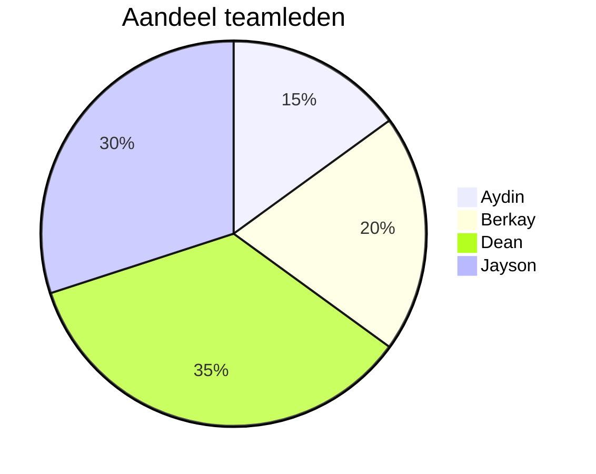

# Retrospective sprint 0
## Uitkomst retrospective

   

## Verbeterpunten voor de volgende sprint

- Jayson: Communicatie kan beter omdat we afspraken hebben gemaakt in het samenwerkings contract over dat je meld of je te laat bent of er niet bent, helaas was dit niet van toepassing en werden we nooit op de hoogte gesteld.

- Aydin: bij de daily-standup zou ik graag ook personlijke doelen willen doornemen, om bijvoorbeeld aan te geven naast het zakelijke dat ik javascript ga leren op die dag.

- Dean: Meer initiatief tonen om taken op te pakken, dit moet niet van andere mensen komen maar van jezelf. We moeten meer afweten wat er moet gebeuren voor het project en zelf ook input tonen in plaats van af te wachten tot dat iemand jou een taak geeft om te doen.

## Aandeel teamleden

## Feedback n.a.v. sprint 0
### Feedback Jayson

#### Tops
1. Behulpzaamheid;
2. Inzet/initiatief;      

#### Tips
1. Betere concentratie op 1 taak;  
2. Ga vooral zo door;  
 

### Feedback Dean

#### Tops
1. Creativiteit
2. Inzet/initiatief   

#### Tips
1. Meer laten zien van wat hij heeft gedaan;
2. Ga vooral zo door;
 

### Feedback Berkay

#### Tops

1. initiatief;
2. kwam met veel ideeën;

#### Tips

1. Wat netter werken;
2. Iets meer uit zichzelf taken oppakken;
 

### Feedback Aydin

#### Tops
1. Goede ideeën;
2. Fijn om mee samen te werken;  

#### Tips
1. Meer betrokkenheid;   
2. Iets meer initiatief; 

## Reflecteren op Feedback en sprint 0
De Feedback die ik heb gekregen van het team, is dat ik moet werken aan mijn concentratie. Dit was voor mij vorig blok ook een verbeterpunt, dus ik herken dit wel. Echter vind ik wel dat het al een stuk beter gaat dan het vorige blok. Wat nu vooral gebeurd is dat ik met meerdere taken tegelijk bezig ben (onbewust). Wanneer ik meerdere taken heb, vind ik het erg moeilijk om op 1 gefocust te blijven. Hieraan werken is echter wel lastig voor mij, omdat ik ADD heb. Desondanks wil ik er natuurlijk alles aan doen om hieraan te werken. Dus mijn plan van aanpak om hieraan te werken zal als volgt zijn: Ik ga aan het beginvan elke dag wanneer mijn taken bekend zijn, een lijstje maken met de taken op basis van prioriteit. Op deze manier kan ik zien welke taken ik als eerst op moet pakken. Zo kan ik op volgorde zien welke taken ik moet oppakken en me zo makkelijker focussen op individuele taken. 