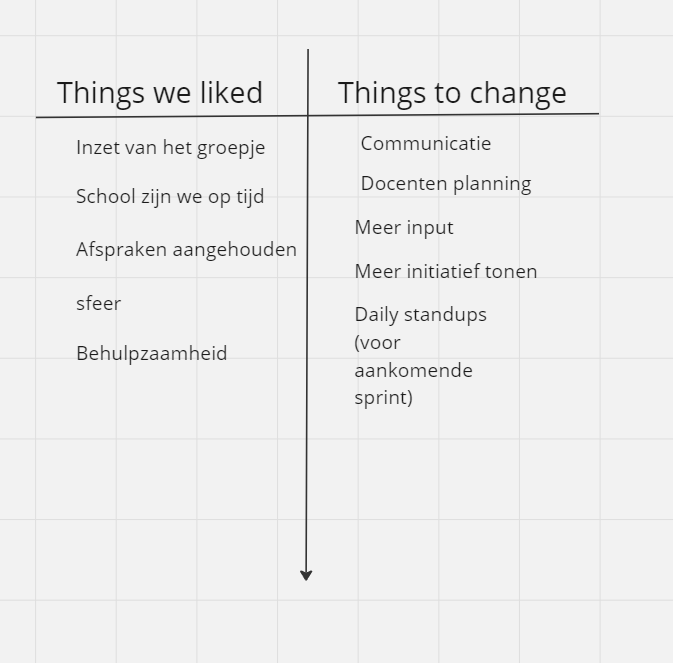
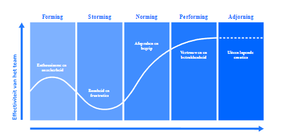

# Retrospective sprint 1

### Verbeterpunten vorige sprint
// Herhaal hier de verbeterpunten die jullie vorige retrospective hebben opgesteld en beschrijf per punt wat jullie hiermee afgelopen sprint hebben gedaan. Is het opgepakt? Hoe? Heeft het effect gehad?

- Communicatie kan beter omdat we afspraken hebben gemaakt in het samenwerkingscontract over dat je meld of je te laat bent of er niet bent, helaas was dit niet van toepassing en werden we nooit op de hoogte gesteld.

Dit is deze sprint niet erg opgepakt omdat er erg veel individuele opdrachten waren in de vorm van kamers en individuele opdracht waardoor samenwerking en dingen melden aan elkaar een stuk minder nodig was. 

- bij de daily-standup zou ik graag ook personlijke doelen willen doornemen, om bijvoorbeeld aan te geven naast het zakelijke dat ik javascript ga leren op die dag.

Wij hebben deze sprint een stuk minder/ geen daily standups gehouden door deze vele individuele opdrachten er werd af en toe wel een check-up gedaan over iedereen zijn voortgang en of er problemen waren, maar verder is er niks speciaals hiermee verbeterd of gebeurt. Ik wilde wel altijd een daily stand-up houden, maar mijn groepje zeiden vaak ja we doen toch allemaal hetzelfde.

- Meer initiatief tonen om taken op te pakken, dit moet niet van andere mensen komen maar van jezelf. We moeten meer afweten wat er moet gebeuren voor het project en zelf ook input tonen in plaats van af te wachten tot dat iemand jou een taak geeft om te doen.

Deze sprint waren ik en Aydin nog veel bezig met individuele opdracht en rooms waardoor wij minder tijd hadden om veel initiatief te tonen. Jayson had wel een kleine logica gemaakt waardoor je eerst moet examinen voordat je met iets mocht interacten en dat is wel een goede input. 

#### Uitkomst retrospective

### Verbeterpunten voor de volgende sprint
// Maak een lijstje van 2 - 5 zaken die jullie in de volgende sprint willen verbeteren. Formuleer deze zo concreet mogelijk.
Daily standup: Wij willen deze sprint daily standups weer gaan doen en met de extra info dat we ook persoonlijke doelen hierbij opstellen voor die dag dus bijvoorbeeld javascript oefenen. Dit zou mijn gropepje ook weer liever willen doen, omdat we nu meer samen gaan werken en onze rooms met elkaar moeten combineren. 
Communicatie: Communicatie is altijd iets dat verbeterd kan worden. Wij hebben wel vaker gemeld dat we later zijn, maar er is minder communicatie gebeurd over het algemeen, omdat diut vooral individuele taken waren.
Meer initiatief: Er is deze sprint een stuk minder initiatief getoont, omdat veel mensen de individuele opdracht nog niet af hadden waardoor we eigenlijk een stuk minder tijd hadden dan de rest. Hierdoor heb je minder tijd en vrijheid om dingen uit jezelf op te kunnen pakken wat we dus volgende sprint wel weer willen doen. 

Teamontwikkeling
// Beschrijf jullie teamontwikkeling over de afgelopen 6 weken aan de hand van de fases van Tuckman. Welke fases hebben jullie doorlopen? Waaraan was dat herkenbaar? In welke fase zitten jullie nu? Waar zie je dat aan?
#### Forming
Naar ons idee waren wij in de eerste week van sprint 0 vooral in deze fase. We begonnen rijk aan ideeën, enthousiast en begonnen al het uitplannen van de game. Hierbij kwam ook veel onzekerheid kijken aangezien we nog niet alle nodige informatie hadden die nodig was om goed vooruit te denken aan hoe we alles zouden gaan uitwerken.
#### Storming 
Van sprint 0 week 2, t/m sprint 1 week 1 (De duratie van de individuele opdracht) denken wij dat we door deze fase zijn gegaan. In sprint 0 speelde er wat boosheid tussen het team omdat er taken niet eerlijk werden verdeeld en er weinig input/initiatief was. We waren allemaal best gefrustreerd vanwege de individuele opdracht, en dit bracht ook veel onzekerheden over het beginnen aan ons echte project. Ook kregen we hier pas net de game engine wat allemaal vrij laat was, waar we dus nog mee om moesten leren gaan. Het was allemaal in een keer een hele hoop dingen die erg last moment waren en veel tijd in namen. Hierdoor was er veel irritatie in het team. 

#### Norming
Vanaf sprint 1 week 2 begon alles een stukje beter te gaan. We konden gaan beginnen aan de game, aan de hand van de dingen die we eerder hadden besproken. De afspraken die we eerder hadden gemaakt, en de afspraken die we nieuw hadden besproken in deze fase waren nu duidelijk en begonnen we ons ook meer aan te houden. Iedereen kon lekker aan de slag aan hun eigen onderdeel van het project.

#### Performing: 
In deze fase zijn we nog niet aangekomen en zullen we waarschijnlijk in de nabije toekomst in komen

#### Aandeel teamleden
// geef per teamlid aan hoeveel storypoints hij/zij deze sprint heeft kunnen realiseren. Vervang hieronder de namen van de teamleden en geef per teamlid het aantal storypoints. De mermaid code genereert vervolgens een pie-chart. Geef onder de pie chart een korte toelichting: wat valt op? Kunnen jullie de verschillen verklaren?

pie 
    title Storypoints per Teamlid   
    "Aydin" : 10
    "Berkay" : 15
    "Dean" : 18
    "Jayson" : 21

Het valt op dat ik en Aydin een stuk minder punten hebben dan Jayson en Dean

Het verschil in het aantal punten komt, omdat Aydin en ik nog even bezig waren met de individuele opdracht waardoor we druk daarmee bezig waren en het verschil in de puzzel moeilijkheid logica tussen de rooms waarbij de logica in de entrance en Library iets makkelijker is dan de diningroom en laboratory
## Feedback voor teamleden

// Geef hieronder zo specifiek mogelijke feedback voor elk teamlid.

// tip: bereid de feedback op je teamleden eerst individueel voor en ga dan pas samen zitten.

// herhaal onderstaande kopjes voor elk teamlid.

### Feedback Berkay

#### Tops
- Je hebt input laten zien voor je opdracht.

Kwam met veel ideeen voor zijn kamer en is ambitieus over het uitwerken hiervan dit is iets wat motiverend kan zijn voor anderen. Bijvoorbeeld het idee dat een item 2 items noidig heeft om een nieuw item te maken en als dit niet de juiste combinatie is dat je dan damage neemt. 
// gezamenlijk zorg je per teamlid voor minimaal 2 complimenten.

- Je bent een doorzetter

Ik heb desondanks ik wat later begonnen met mijn opdracht heb ik genoeg doorgezet waardoor ik bij kwam met iedereen. 

### Tips

- Communicatie

Er werd deze sprint weinig gemeld vooral in de online gesprekken en dat zorgde ervoor dat er niet veel verbetering was in communicatie.

- Meer bespreken 
  
Ik was iets enthousiast met ideeen en heb per ongeluk een idee dat ik niet had besproken tijdens de product review vertelt over de map klikbaar maken waardoor er wat onenigheid ontstond

### Feedback Dean

#### Tops
- inzet van Dean was goed

Ondanks dat Dean even ziek was heeft hij toch op belangrijke dagen de moeite gedaan om toch naar school te komen zodat hij zijn team niet in de steek laat. 

- Behulpzaam

Hij heeft op meerdere momenten vooral eerder in het project het team geholpen als we ergens vastliepen. 

### Tips

- Werkhouding

Hij heeft momenten in de klas waar zijn werkhouding erg onserieus is in de klas. 

- Zo doorgaan!

### Feedback Aydin

#### Tops

- Goede ideeen

Aydin komt op met goede ideeen die hij wil implementeren in zijn room. Hij heeft creatieve ideeen die soms wat ambitieus zijn maar ze zijn altijd goede dingen om toe te voegen als we de tijd ervoor hebben

- Helpt graag en vraagt makkelijk hulp

Ik heb meerdere keren Aydin geholpen met problemen en hij heeft meerdere keren iets bedacht waardoor ik verder kon met mijn kamer om dingen op te lossen. Ik heb hem erg vaak geholpen met de get logica bijvoorbeeld in de individuele opdracht en heb hem vaker geholpen met ideeen hoe hij zijn riddles zou moeten verwerken in zijn opdracht. 

- Productiever

Hij doet veel meer aan het project aan deze sprint dan vorige sprint hij heeft namelijk zijn kamer al zowat af. 

### Tips

- Betrokkenheid

Er word veel samengewerkt maar nog niet met de hele groep dit is nog vooral alleen met mij en niet met de andere 2 veel, waardoor hij wat minder betrokken is dan de rest. 
- Doelgericht werken

Hij kan meer in het thema van zijn room werken, omdat er op dit moment nog weinig eten in zijn room te vinden is, terwijl het idee van de diningroom was om een heal plaats te zijn met eten etc. 

### Feedback Jayson

#### Tops

- Leiderschap

Hij heeft het team in de goede richting geleid op de juiste momenten zodat het team doelgericht aan het werk is. Dit is bijvoorbeeld laten zien door vaker dingen oppakken zoals de branches logica goed zetten. 

- Behulpzaam

Wanneer er dingen worden gevraagd is Jayson altijd aanwezig om te helpen waarbij hij samen naar je code/ probleem gaat kijken om tot een goede oplossing te komen. 
### Tips

- Werkhouding

Hij heeft momenten in de klas waar zijn werkhouding erg onserieus is in de klas. 

- Zo doorgaan!